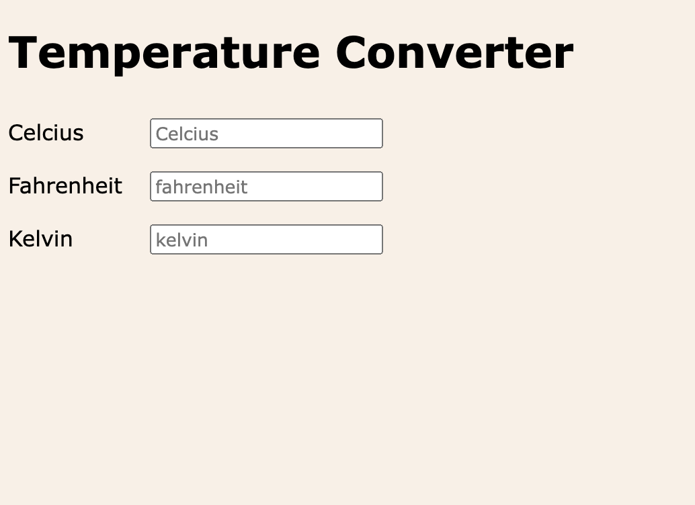

# Gasoline price calculator

Make a web program that transforms temperature from one unit to other units. (For example, Celsius to Fahrenheit and Kelvin).
The answer should be visible in other inputs as a value.

## Example

